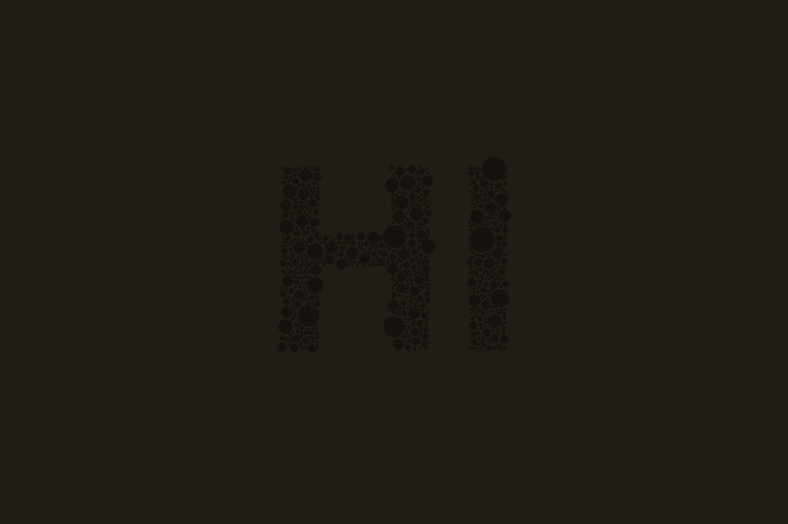
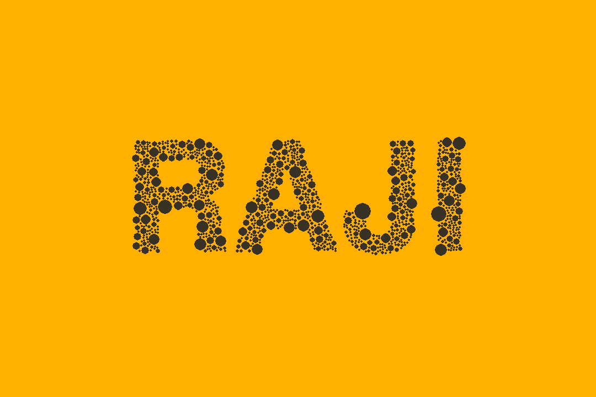
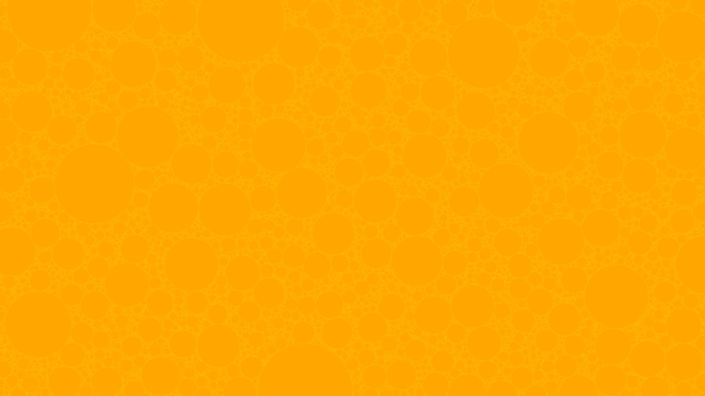

# circle-packing-art-visualization
Python based customizable circle packing and visualization using pygame library, apply to image or text.

### Image

### Text

### Texture

### For further (circlism Art)
[take a look about circlism](https://github.com/ArihantJain456/Circlism)

